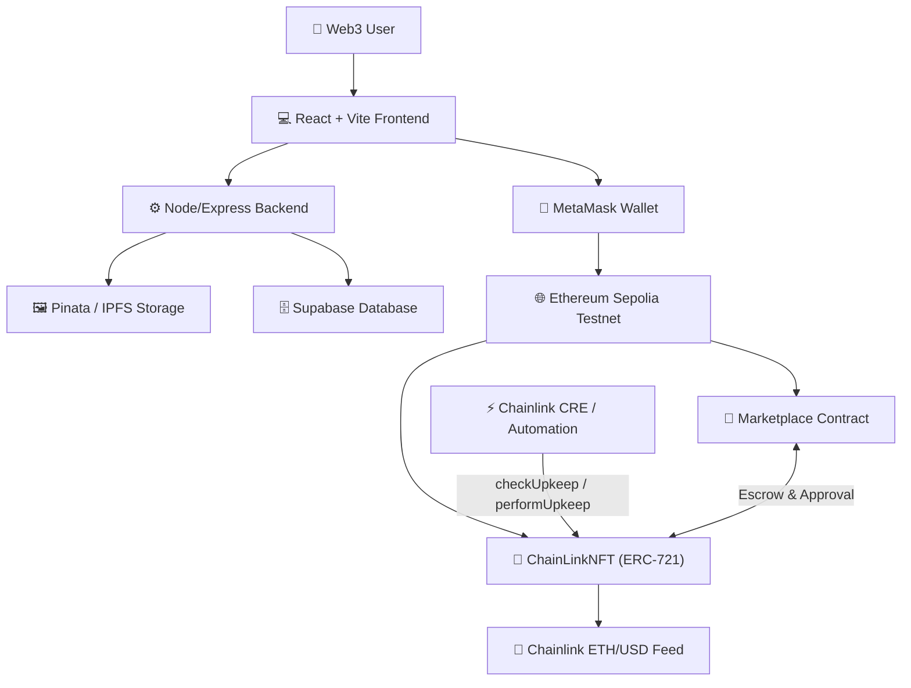
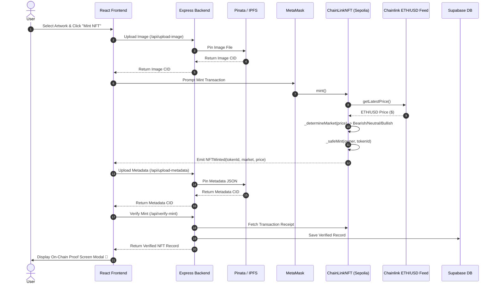
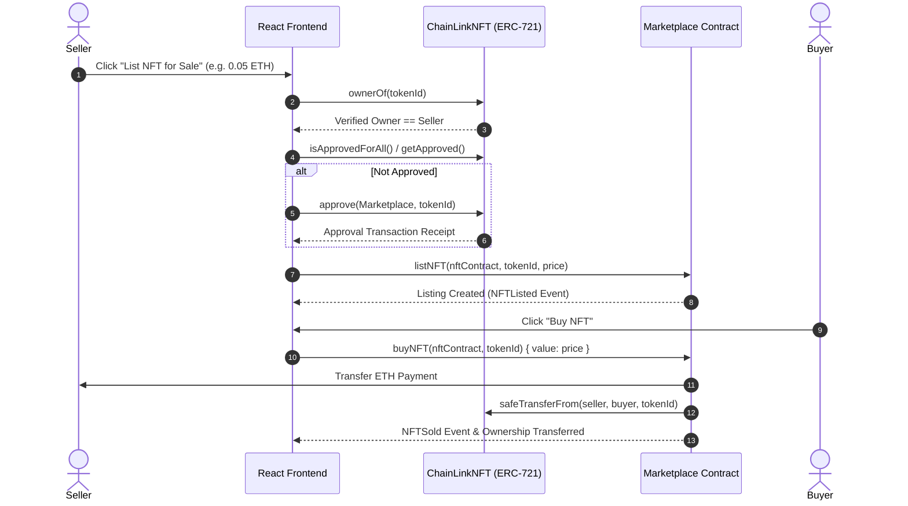
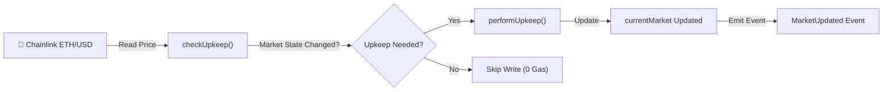
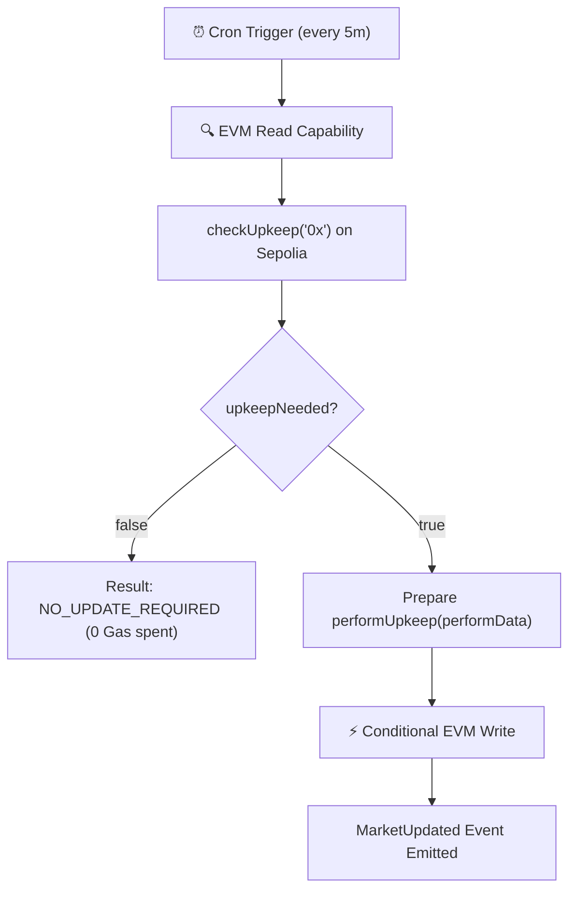

# ChainLinkNFT

> Dynamic NFTs powered by Chainlink ETH/USD market data, immutable on-chain traits, IPFS provenance, Chainlink Automation/CRE, and an ERC-721 marketplace on Ethereum Sepolia.

---

## 🚀 Overview

**ChainLinkNFT** is a full-stack Web3 application where NFTs receive an **immutable market trait** at the exact moment of minting, determined directly on-chain by the **Chainlink ETH/USD Price Feed**.

### Market Trait Classification:
- **Bearish 🐻:** ETH/USD price `< $2,500`
- **Neutral ⚖️:** `$2,500 ≤ ETH/USD price ≤ $4,000`
- **Bullish 🐂:** ETH/USD price `> $4,000`

> 🔒 **Mint Immutability:** Once minted, an NFT's recorded market trait and price at mint remain **100% immutable** on-chain. Even if live market prices shift, the historical snapshot on the NFT remains untouched.

### Combined Web3 Architecture:
- **Chainlink Oracles:** Real-time ETH/USD price feed (`0x694AA1769357215DE4FAC081bf1f309aDC325306`)
- **Dynamic NFT Minting:** Immutable market traits assigned automatically upon minting
- **IPFS Storage:** Dual asset pinning via Pinata (Image CID + Metadata JSON CID)
- **ERC-721 Ownership:** Verified via `ownerOf(tokenId)` with mainnet ENS resolution
- **Safe RPC Transfer History:** Scans on-chain `Transfer` events using topic0-only filters & safe block chunking
- **Chainlink Automation & CRE Workflow:** Off-chain `checkUpkeep` capability and conditional `performUpkeep` protocol state updates
- **Decentralized NFT Marketplace:** Non-custodial listing, buying, and cancelling with two-step ERC-721 approval
- **Demo Oracle Developer Mode:** Toggleable `MockV3Aggregator` for judge testing across all three market brackets
- **Full-Stack Application:** React + Vite, Ethers.js v6, Node.js/Express verification backend, Supabase DB

---

## ✨ Key Features

### 🔗 Chainlink ETH/USD Oracle Integration
Reads live market price directly from the Sepolia Chainlink Data Feed with staleness guards (`< 3 hours`) and positive price validation (`> 0`).

### 🎨 Dynamic NFT Traits & 🔒 Immutability
NFTs are stamped with `Bearish`, `Neutral`, or `Bullish` traits upon minting. The on-chain contract stores `tokenMarket[tokenId]` and `tokenMintPrice[tokenId]`, ensuring historical immutability.

### 🖼️ Dual IPFS Asset Pinning
Uploads artwork images and structured ERC-721 JSON metadata to Pinata IPFS, clearly separating Image CID (`ipfs://bafk...`) from Metadata CID.

### 👛 Wallet Integration & 🌐 Sepolia Network Guard
Connects seamlessly via MetaMask. Automatically detects chain ID (`11155111` / `0xaa36a7`) and prompts users to switch to Sepolia if connected to an unsupported network.

### 🏷️ Mainnet ENS Resolution
Resolves human-readable `.eth` names for wallet addresses via Ethereum mainnet lookup with local session caching.

### 🔍 On-Chain Provenance & Premium NFT Detail Modal
Displays complete token provenance: Token ID, ETH/USD price at mint, Market trait at mint, current verified owner, block number, contract address, Etherscan link, IPFS metadata, and IPFS artwork image.

### 🔄 Ownership Verification
Validates token ownership directly on-chain using ERC-721 `ownerOf(tokenId)`.

### 📜 Safe ERC-721 Transfer History
Queries historical `Transfer` events directly from Sepolia RPC using safe topic0 filtering (`contract.filters.Transfer()`), dynamic mint block resolution (`tx.blockNumber - 5`), 4,500-block chunking, client-side token filtering, and deduplication.

### ⚡ Chainlink Automation (`checkUpkeep` & `performUpkeep`)
Maintains the contract's protocol-wide `currentMarket` state. When market conditions cross threshold boundaries, Automation triggers `performUpkeep` without mutating historical NFT traits.

### 🌐 Chainlink Runtime Environment (CRE) Workflow
Configured with a 5-minute cron schedule capability. Performs an off-chain EVM read (`checkUpkeep`), evaluating whether state updates are required before executing on-chain transactions. Tested via local simulation using the `@chainlink/cre-sdk`.

### 🛒 Decentralized NFT Marketplace
Allows NFT owners to list, cancel, and sell NFTs. Enforces two-step ERC-721 approval (`isApprovedForAll` / `approve`) before executing `listNFT()`, protected by OpenZeppelin `ReentrancyGuard`.

### 🧪 Demo Oracle Developer Mode
Includes a toggleable Demo Mode pointed to `MockV3Aggregator` on Sepolia. Allows developers and judges to update the mock feed to `$1,500` (Bearish), `$3,000` (Neutral), or `$5,000` (Bullish) and verify all three market trait mints on-chain.

### ⚡ On-Chain Activity Feed
Displays real-time blockchain activity (`🟢 NFT Minted`, `🟣 NFT Listed`, `🔵 NFT Transferred`, `🟠 NFT Sold`) with block numbers and Etherscan links.

### 📊 Collection Statistics
Displays entire collection counts by trait bracket (`Bearish`, `Neutral`, `Bullish`, `Wallet Owned`).

### 🔎 Marketplace Sorting
Supports sorting marketplace listings by `Latest Listed / Minted`, `Price: Low → High`, `Price: High → Low`, `Token ID`, and `Market Trait`.

---

## 🏗️ Architecture



---

## 🔄 End-to-End Mint Pipeline



---

## 🛒 Marketplace Listing & Purchase Flow



---

## ⚡ Automation Architecture



---

## 🌐 Chainlink CRE Architecture

The Chainlink Runtime Environment (CRE) workflow uses a TypeScript handler configured with a 5-minute cron schedule capability:



> ℹ️ **Deployment Note:** The CRE workflow has been tested and verified via **Local Simulation** (`npx tsx test-simulate.ts`). Production Decentralized Oracle Network (DON) deployment requires active Chainlink DON workflow registration.

---

## 🛠️ Tech Stack

| Layer | Technologies Used |
| :--- | :--- |
| **Frontend** | React, Vite, Vanilla CSS (Glassmorphism), Ethers.js v6 |
| **Smart Contracts** | Solidity `0.8.24`, OpenZeppelin (`ERC721`, `ReentrancyGuard`), Foundry (`forge`) |
| **Blockchain** | Ethereum Sepolia Testnet |
| **Oracles & Automation** | Chainlink ETH/USD Price Feed, Chainlink Automation, Chainlink CRE (`@chainlink/cre-sdk`) |
| **Storage** | IPFS via Pinata Gateway (Image CID & Metadata CID) |
| **Backend** | Node.js, Express, Axios, FormData, Express Rate Limit |
| **Database** | Supabase (PostgreSQL) |
| **Wallet & Identity** | MetaMask Browser Provider, Mainnet ENS Resolution |

---

## 📜 Smart Contracts

### 1. `ChainLinkNFT.sol`
- **ERC-721 Token** with immutable mint-time price (`tokenMintPrice`) and market trait (`tokenMarket`).
- Connects to `AggregatorV3Interface` to read real-time ETH/USD price.
- Implements `AutomationCompatibleInterface` (`checkUpkeep` & `performUpkeep`).

### 2. `Marketplace.sol`
- Non-custodial marketplace supporting listing, purchasing, and cancelling ERC-721 NFTs.
- Enforces owner verification and ERC-721 approval checks before listing.
- Protected against reentrancy using OpenZeppelin `ReentrancyGuard` and Checks-Effects-Interactions pattern.

### 3. `MockV3Aggregator.sol`
- Chainlink mock price feed deployed on Sepolia (`0x25237C...`).
- Exposes `updateAnswer(int256)` to simulate price changes for testing all market trait brackets.

---

## 📌 Deployed Sepolia Smart Contracts

| Contract / Resource | Sepolia Contract Address | Etherscan Link |
| :--- | :--- | :--- |
| **Production `ChainLinkNFT`** | `0xBAA134b625B181cA6A924A2aa569c87bde86Cc1D` | [View on Etherscan ↗](https://sepolia.etherscan.io/address/0xBAA134b625B181cA6A924A2aa569c87bde86Cc1D) |
| **Demo `ChainLinkNFT`** | `0x20448357d01140555f321dA3E4f88c1229214910` | [View on Etherscan ↗](https://sepolia.etherscan.io/address/0x20448357d01140555f321dA3E4f88c1229214910) |
| **`MockV3Aggregator` (Demo Feed)** | `0x25237Cf4480c6Ea22010970F27Bb52382DbA267a` | [View on Etherscan ↗](https://sepolia.etherscan.io/address/0x25237Cf4480c6Ea22010970F27Bb52382DbA267a) |
| **`Marketplace`** | `0xdd8e21254c1f493B121414B9dD648F8e7e0A213F` | [View on Etherscan ↗](https://sepolia.etherscan.io/address/0xdd8e21254c1f493B121414B9dD648F8e7e0A213F) |
| **Chainlink ETH/USD Feed** | `0x694AA1769357215DE4FAC081bf1f309aDC325306` | [View on Etherscan ↗](https://sepolia.etherscan.io/address/0x694AA1769357215DE4FAC081bf1f309aDC325306) |

---

## 🧪 Testing & Verification Summary

### Foundry Smart Contract Test Suite (`forge test`)
- **Total Tests:** **27 / 27 Passed**
  - `ChainLinkNFTTest`: **12/12 Passed**
  - `MarketplaceTest`: **10/10 Passed**
  - `DemoChainLinkNFTTest`: **5/5 Passed**

### CRE Off-Chain Simulation
- Verified off-chain `checkUpkeep` EVM read capability against Sepolia contract state using `npx tsx test-simulate.ts`.

### Frontend Production Build
- `npm run build` in `frontend/`: **PASS** (213 modules compiled in 437ms with 0 errors).

---

## 🔒 Security & Verifications

- **Reentrancy Protection:** `Marketplace.sol` inherits OpenZeppelin `ReentrancyGuard` and applies `nonReentrant` modifier to `listNFT`, `cancelListing`, and `buyNFT`.
- **Checks-Effects-Interactions Pattern:** Listing active state (`listing.active = false`) is updated prior to external ETH transfers and `safeTransferFrom` execution.
- **Oracle Staleness & Positive Price Guards:** `ChainLinkNFT.sol` validates `price > 0` and `block.timestamp - updatedAt < 3 hours`.
- **ERC-721 Approval Validation:** Frontend verifies `isApprovedForAll` and `getApproved` before initiating `listNFT()`.
- **Sepolia Network Guard:** Frontend blocks contract calls on unsupported chain IDs.
- **Backend Receipt Verification:** `/api/verify-mint` validates Sepolia transaction receipts on-chain before database insertion.
- **Secrets Isolation:** Sensitive keys (`PRIVATE_KEY`, `PINATA_JWT`, `SUPABASE_SERVICE_ROLE_KEY`) exist strictly in server-side configuration and are ignored by `.gitignore`.

---

## 📂 Project Structure

```
chainlink-nft/
├── README.md                      # GitHub Repository Documentation
├── foundry.toml                   # Foundry Configuration
├── ChainLinkNFT.abi.json          # Compiled ERC-721 Contract ABI
├── .gitignore                     # Git Exclusion Rules
├── src/
│   ├── ChainLinkNFT.sol           # Main Dynamic ERC-721 Contract
│   ├── Marketplace.sol            # Non-Custodial NFT Marketplace Contract
│   └── MockV3Aggregator.sol       # Chainlink Price Feed Mock Contract
├── test/
│   ├── ChainLinkNFT.t.sol         # ChainLinkNFT Unit Tests (12 tests)
│   ├── Marketplace.t.sol          # Marketplace Integration Tests (10 tests)
│   └── DemoChainLinkNFT.t.sol     # Demo Oracle Integration Tests (5 tests)
├── script/
│   ├── Deploy.s.sol               # ChainLinkNFT Foundry Deployment Script
│   └── DeployMarketplace.s.sol    # Marketplace Foundry Deployment Script
├── backend/
│   ├── index.js                   # Express Server Entrypoint
│   ├── blockchain.js              # Ethers.js Sepolia Provider & Contract Setup
│   ├── supabase.js                # Supabase Client Instance
│   ├── .env.example               # Backend Environment Template
│   └── routes/
│       ├── mint.js                # On-Chain Mint Verification Endpoint
│       └── upload.js              # Pinata IPFS Upload Endpoints
├── frontend/
│   ├── index.html                 # HTML Entrypoint
│   ├── vite.config.js             # Vite Build Configuration
│   ├── .env.example               # Frontend Environment Template
│   └── src/
│       ├── main.jsx               # React Root Render
│       ├── App.jsx                # Web3 Application Logic & UI
│       ├── App.css                # Glassmorphism & Trait Accent Styling
│       ├── contract.js            # Contract Addresses & ABIs
│       ├── marketplaceContract.js # Marketplace Contract Address & ABI
│       ├── mockContract.js        # Mock Feed ABI
│       └── supabase.js            # Frontend Supabase Client
└── cre-workflow/
    ├── cre.config.json            # CRE Configuration
    ├── package.json               # CRE SDK Dependencies
    ├── test-simulate.ts           # CRE Local Simulation Script
    └── src/
        ├── index.ts               # CRE Cron Handler Logic
        └── abi.ts                 # Contract ABI Exports
```

---

## 💻 Local Setup & Installation

### Prerequisites
- Node.js `v18+` or `v20+`
- Foundry (`forge` / `cast`)
- MetaMask browser extension connected to **Ethereum Sepolia**

### 1. Clone & Build Contracts
```bash
git clone https://github.com/your-username/chainlink-nft.git
cd chainlink-nft

# Build contracts
forge build

# Run unit tests
forge test
```

### 2. Configure & Start Backend
```bash
cd backend
npm install

# Copy environment template
cp .env.example .env
# Edit .env with your SUPABASE_URL, SUPABASE_SERVICE_ROLE_KEY, and PINATA_JWT

# Start backend
npm start
```

### 3. Configure & Start Frontend
```bash
cd ../frontend
npm install

# Copy environment template
cp .env.example .env
# Edit .env with VITE_BACKEND_URL=http://localhost:3001

# Start Vite dev server
npm run dev
```

### 4. Run CRE Simulation
```bash
cd ../cre-workflow
npm install

# Run off-chain CRE workflow simulation
npx tsx test-simulate.ts
```

---

## 🔑 Environment Variables

### Frontend Variables (`frontend/.env`)
- `VITE_BACKEND_URL` — Backend API URL (e.g. `http://localhost:3001`)
- `VITE_SUPABASE_URL` — Supabase Project URL
- `VITE_SUPABASE_ANON_KEY` — Supabase Public Anon Key

### Backend Variables (`backend/.env`)
- `PORT` — Server Port (default `3001`)
- `FRONTEND_ORIGIN` — Allowed CORS Origin (default `http://localhost:5173`)
- `SUPABASE_URL` — Supabase Project URL
- `SUPABASE_SERVICE_ROLE_KEY` — Supabase Server Role Key
- `PINATA_JWT` — Pinata IPFS API JWT Token
- `SEPOLIA_RPC_URL` — Sepolia JSON-RPC Endpoint
- `CONTRACT_ADDRESS` — Target NFT Contract Address

---

## 🎮 Hackathon Demo Guide for Judges

1. **Connect Wallet:** Click `Connect Wallet` in top navbar and connect MetaMask to Sepolia.
2. **Oracle Mode Toggle:** Switch top toggle to `🟡 Demo Oracle` mode.
3. **Set Bearish Price:** Under Demo Oracle Controls, click `🐻 Set Bearish ($1,500)`. Confirm MetaMask transaction.
4. **Mint Bearish NFT:** Upload an artwork image and click `🟡 Mint NFT on Sepolia (Demo)`. Observe the 6-step progress pipeline.
5. **Inspect Proof Screen:** Review the On-Chain Proof Screen modal displaying Token ID, `$1,500` mint price, `Bearish 🐻` trait, and Etherscan/IPFS links.
6. **Set Neutral Price:** Under Demo Controls, click `⚖️ Set Neutral ($3,000)`. Confirm transaction.
7. **Mint Neutral NFT:** Mint a second NFT and observe `Neutral ⚖️` trait assigned.
8. **Set Bullish Price:** Under Demo Controls, click `🐂 Set Bullish ($5,000)`. Confirm transaction.
9. **Mint Bullish NFT:** Mint a third NFT and observe `Bullish 🐂` trait assigned.
10. **Verify Immutability:** Change Demo Oracle price back to `$1,500`. Observe that previously minted Neutral and Bullish NFTs retain their original traits permanently.
11. **Open NFT Detail View:** Click `📜 Provenance` on any NFT card to view the multi-section Detail View.
12. **Verify IPFS Assets:** Click `[ 📋 View Metadata ]` to inspect raw IPFS JSON and `[ 🖼️ View Image ]` to inspect artwork CID.
13. **Check Transfer History:** Review safe ERC-721 transfer timeline in the detail modal.
14. **List NFT for Sale:** Click `🏷️ List` on an owned NFT. Enter `0.05 ETH`, confirm ERC-721 approval in MetaMask, then confirm listing transaction.
15. **Verify Marketplace Tab:** Click `Marketplace` in navbar. Verify listed NFT appears with `🟢 FOR SALE • 0.05 ETH`.
16. **Test Marketplace Sorting:** Select `Price: Low → High` or `Market Trait` in the sort dropdown.
17. **Buy Listed NFT:** Switch MetaMask accounts, browse to `Marketplace`, and click `Buy 0.05 ETH`. Confirm purchase.
18. **Verify Ownership Transfer:** Confirm token ownership transfers to buyer and listing deactivates.
19. **View Activity Feed:** Click `⚡ Activity` tab to review real-time mint, listing, and sale event logs.
20. **Inspect CRE Simulation:** Run `npx tsx test-simulate.ts` in `cre-workflow/` terminal to simulate CRE EVM reads off-chain.

---

## ⚠️ Limitations & Notes

- **Ethereum Sepolia Testnet:** All smart contract operations take place on the Sepolia testnet.
- **Demo Oracle Scope:** Demo Mode points to `MockV3Aggregator` to allow judges to test all three market brackets on-chain without waiting for real ETH market movements.
- **CRE Execution:** CRE workflow is demonstrated via off-chain simulation using the `@chainlink/cre-sdk`. Production DON workflow deployment requires active Chainlink DON registration.

---

## 🗺️ Future Roadmap

- **Ethereum Mainnet Deployment:** Deploy production contracts to Ethereum Mainnet upon final security auditing.
- **Multi-Asset Oracle Feeds:** Expand dynamic trait parameters to include BTC/USD and LINK/USD feeds.
- **Production CRE DON Workflow:** Register the workflow on Chainlink CRE production DON nodes for fully automated off-chain evaluation.
- **Advanced Marketplace Features:** Implement timed auctions and offer/bidding mechanics.

---

## 📄 License
This project is licensed under the MIT License.
