# ChainLinkNFT

> ERC-721 NFTs with **immutable, on-chain market traits** stamped by the **Chainlink ETH/USD Price Feed** at the exact moment of minting — deployed live on Ethereum Sepolia.


---

## 🎯 What is ChainLinkNFT?

ChainLinkNFT solves a core problem with standard NFTs: **there is no trustless mechanism to capture what market conditions looked like at the moment an NFT was created.**

When a user mints a ChainLinkNFT, the smart contract calls the Chainlink ETH/USD decentralized price feed, reads a validated price, and permanently writes both the price and a derived market classification (`Bearish`, `Neutral`, or `Bullish`) into the token's on-chain storage — in the same atomic transaction as the mint itself. No backend, no admin, no future oracle update can ever change that historical record.

The project also includes a non-custodial `Marketplace` contract for trading, a full Chainlink Automation implementation, a Chainlink Runtime Environment (CRE) TypeScript workflow, and a complete off-chain stack (Node.js/Express backend, Pinata/IPFS pinning, Supabase persistence, React/Vite frontend).

---

## ✨ Key Features

| Feature | Details |
|:---|:---|
| **Immutable Oracle Trait** | Chainlink ETH/USD price read on-chain at mint; stored in `tokenMarket[id]` and `tokenMintPrice[id]` with no setter |
| **Market Classification** | `Bearish` (`< $2,500`), `Neutral` (`$2,500–$4,000`), `Bullish` (`> $4,000`) — computed in `_determineMarket()` |
| **Oracle Validation** | Price must be `> 0`; oracle data must be `< 3 hours` old — both enforced in contract |
| **Dual IPFS Provenance** | Separate Image CID and ERC-721 Metadata JSON CID pinned via Pinata v3 API |
| **On-Chain Mint Verification** | Backend independently parses `NFTMinted` event from Sepolia receipt before Supabase insert |
| **Non-Custodial Marketplace** | Two-step approval + listing; buyer pays seller directly; excess ETH refunded; `ReentrancyGuard` protected |
| **Chainlink Automation** | `checkUpkeep` / `performUpkeep` maintain live protocol-wide `currentMarket` state |
| **Chainlink CRE Workflow** | Off-chain TypeScript cron (every 5 min) wrapping the Automation interface via `EVMClient` |
| **Demo Oracle Mode** | `MockV3Aggregator` on Sepolia lets judges test all three market brackets without waiting for real price movements |
| **ENS Resolution** | Wallet addresses resolved to `.eth` names via mainnet with session caching |
| **Transfer History** | 4,500-block RPC chunks, client-side tokenId filter, deduplication by `txHash + logIndex` |
| **Live Event Listener** | `contract.on('Transfer', ...)` updates ownership in real time |
| **Activity Feed** | Aggregated mint and listing events sorted by timestamp with Etherscan links |
| **Collection Statistics** | Per-trait counts: Bearish / Neutral / Bullish / wallet-owned |
| **Marketplace Sorting** | Latest / Price Low→High / Price High→Low / Token ID / Market Trait |
| **Shareable Proof Links** | `?nft=<tokenId>` URL parameter opens the detail modal directly |
| **Backend Health Display** | Frontend polls `GET /health` and shows backend connectivity status |
| **Rate Limiting** | `express-rate-limit` on upload endpoints (100 req / 15 min) |

---

## 🏗️ Architecture

### 1 — High-Level System Architecture

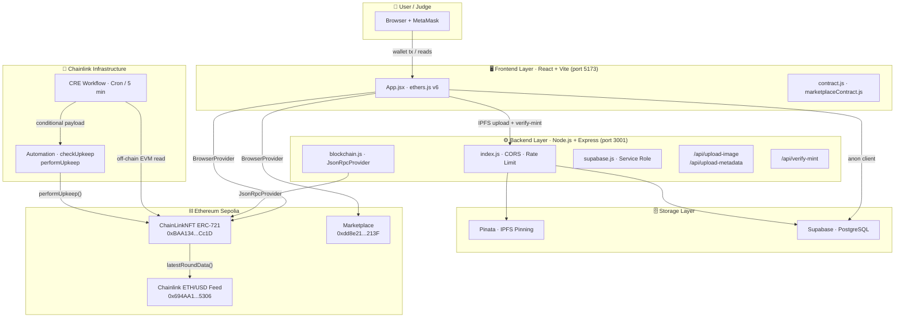

> The frontend communicates with the blockchain directly via MetaMask (`ethers.BrowserProvider`). The backend is a trusted proxy for IPFS pinning and mint verification, keeping all private credentials server-side.

---

### 2 — End-to-End Mint Pipeline

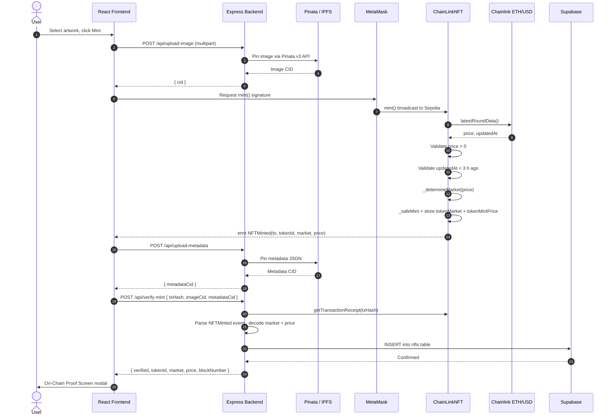

---

### 3 — Oracle Market Classification

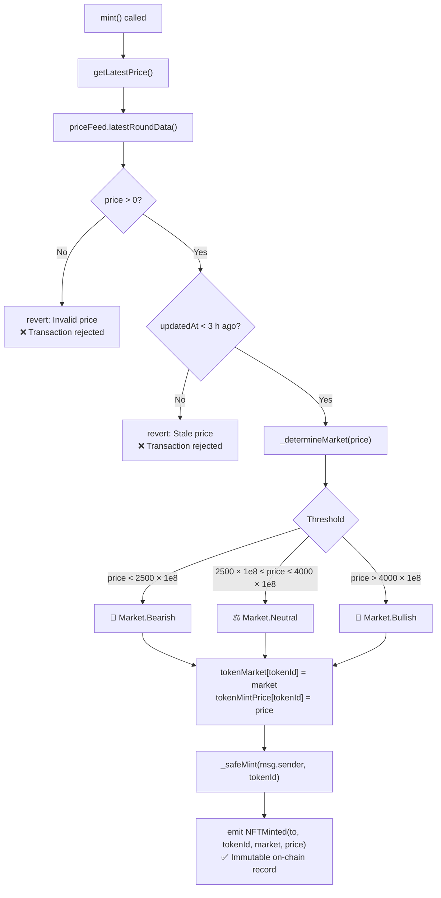

> Prices from Chainlink are in 8-decimal fixed-point format (`$3,000.00` = `300000000000`). Both guards run inside `getLatestPrice()` and will revert the entire `mint()` call on failure — no partial state is written.

---

### 4 — Immutable NFT Trait vs. Live Market State

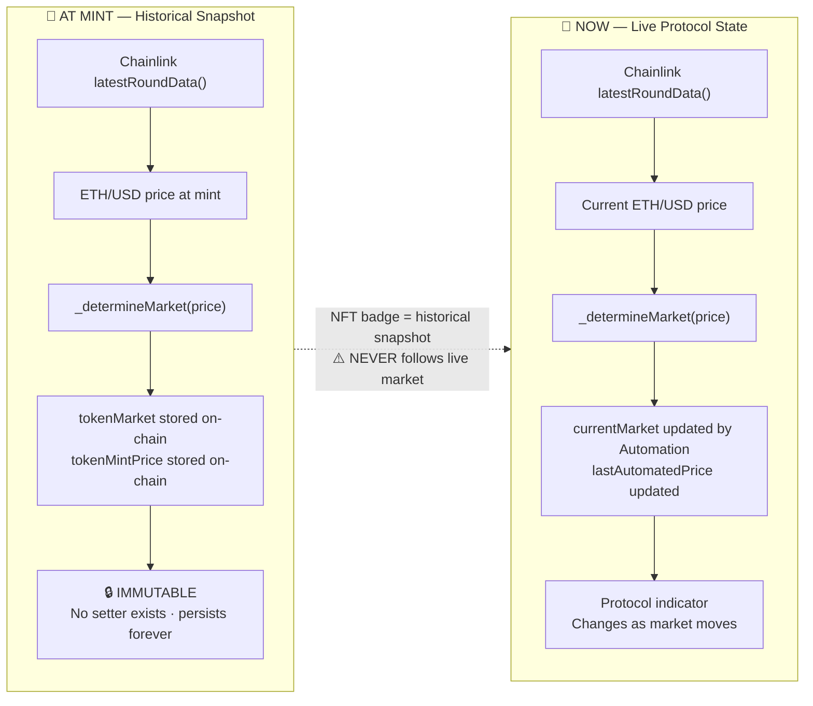

> **This is the core differentiator.** An NFT minted at $3,200 (Neutral) retains its `Neutral` badge permanently, even if ETH subsequently trades at $5,000. `currentMarket` is a separate protocol-level state shown in the frontend header as a live indicator.

---

### 5 — Marketplace Architecture

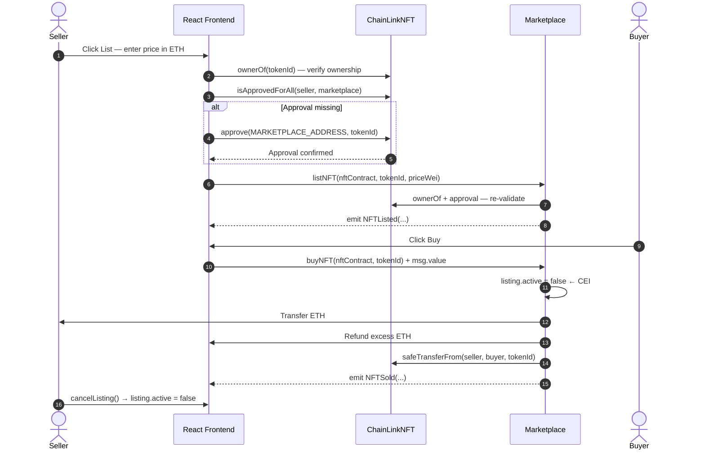

> Security: `ReentrancyGuard` on all state-changing functions. Checks-Effects-Interactions: `listing.active = false` is set **before** any ETH transfer or token transfer. Ownership and approval are re-validated inside `buyNFT` to catch revoked approvals.

---

### 6 — NFT Lifecycle

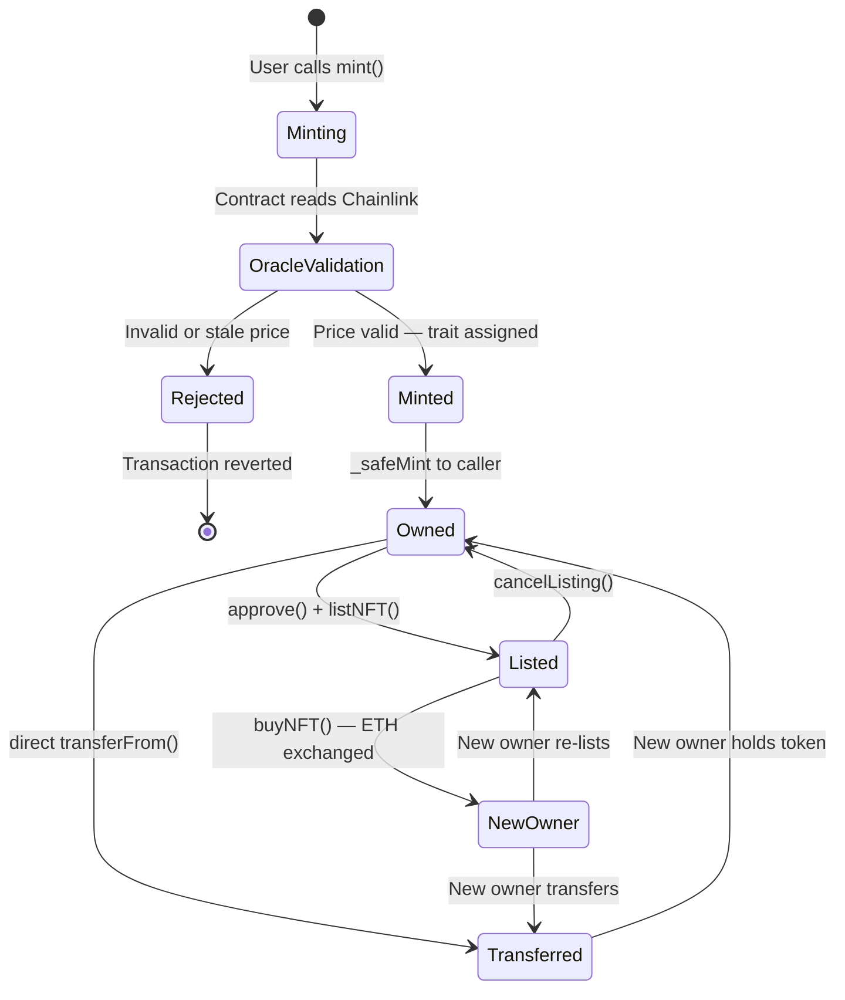

---

### 7 — IPFS Provenance Pipeline

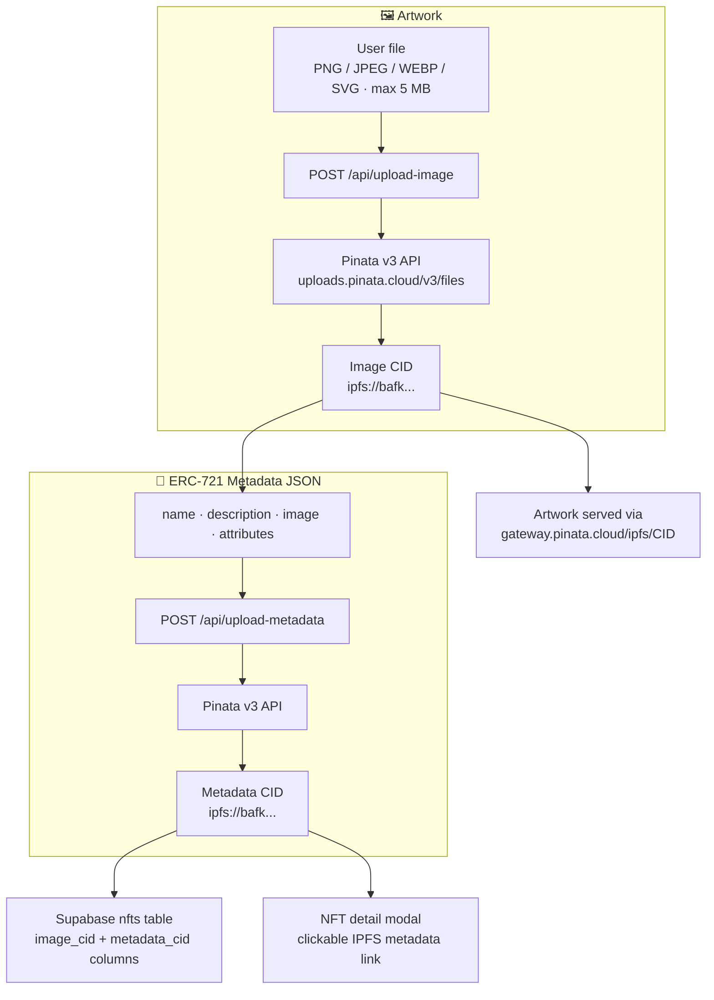

> **Note on `tokenURI`:** The on-chain `tokenURI` returns an inline `data:application/json;utf8,...` base64 response containing only the `Market` attribute. The Pinata metadata CID (which also carries the image URL and ETH/USD value) is stored in Supabase and shown in the frontend detail view.

---

### 8 — Activity Feed Pipeline

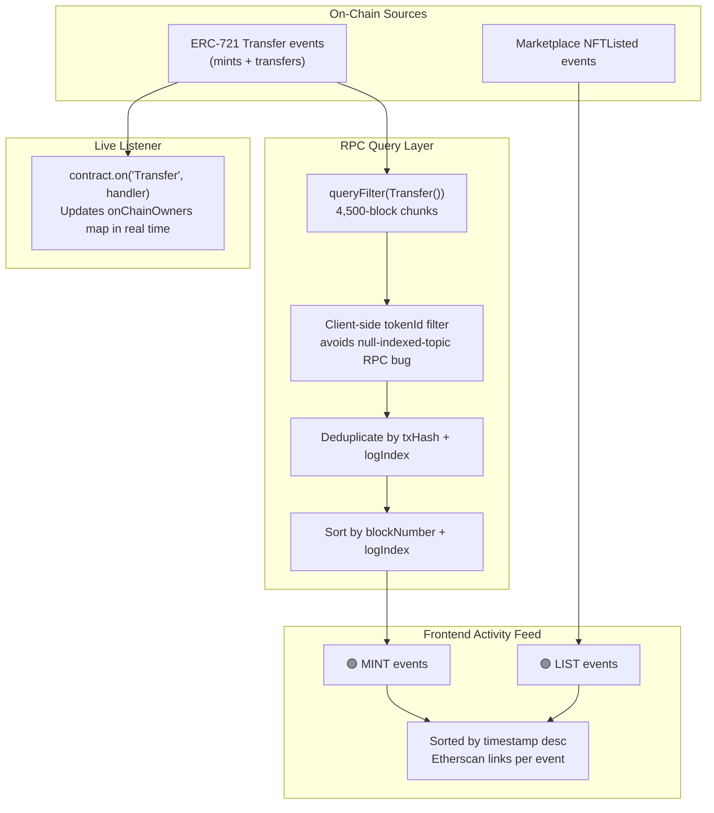

---

### 9 — Chainlink CRE / Automation Pipeline

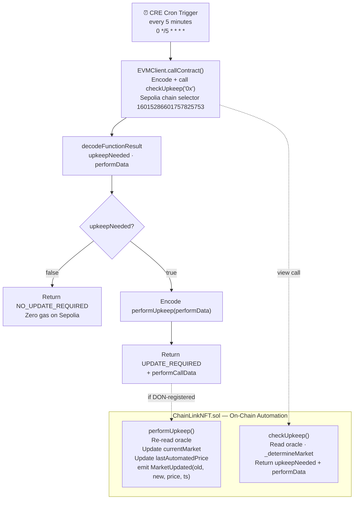

> CRE and Automation update only the protocol-level `currentMarket`. They **cannot** modify any token's `tokenMarket` or `tokenMintPrice` — those have no setter. The CRE workflow is verified locally via `npx tsx test-simulate.ts`. Production DON registration requires a live DON workflow deployment.

---

### 10 — Security Architecture

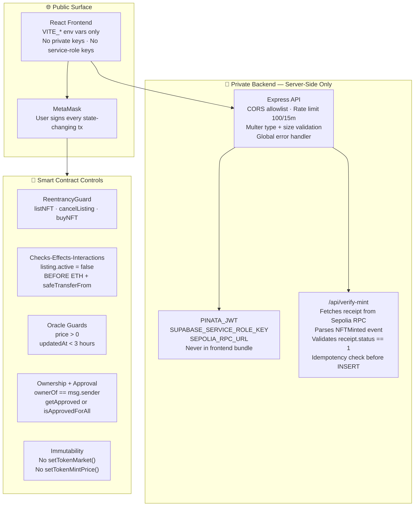

---

### 11 — Production Deployment Architecture

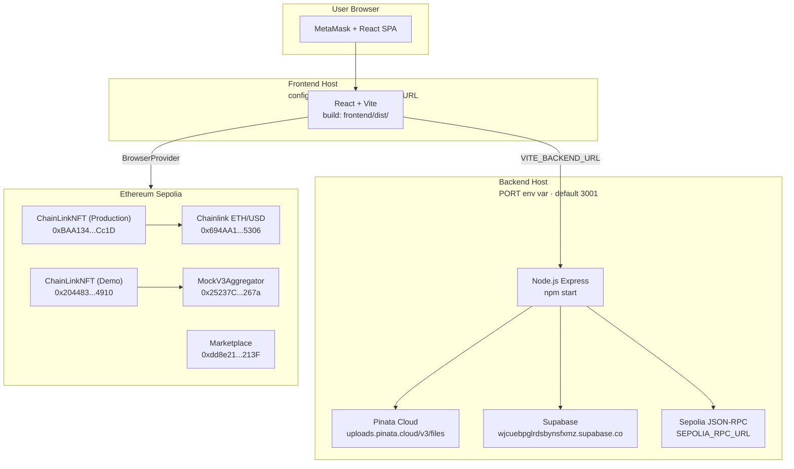

> The repository does not prescribe a specific hosting provider. Frontend and backend can be deployed anywhere; they communicate via `VITE_BACKEND_URL`.

---

## 📊 Product & UX Features

### Market-Specific NFT Cards

Each NFT card is styled with its historical market badge — `Bearish`, `Neutral`, or `Bullish` — using distinct CSS class variants. The badge reflects the price regime at the time the NFT was minted and never changes.

### Immutable Trait Indicator

The detail modal clearly marks the market trait as the historical snapshot at mint. Changing oracle data, Automation updates, or Demo Mode price changes have **zero effect** on any existing token's badge.

### On-Chain Proof Screen

After minting, a dedicated proof modal displays everything needed for independent verification:

| Field | Source |
|:---|:---|
| Token ID | `NFTMinted` event `tokenId` |
| Market at mint | `NFTMinted` event `market` enum |
| ETH/USD at mint | `NFTMinted` event `price` (8-decimal) |
| Owner | `NFTMinted` event `to` |
| Transaction hash | Mint tx hash |
| Block number | Receipt `blockNumber` |
| Contract address | `receipt.to` |
| Etherscan link | Deep link to tx + logs |
| IPFS image link | `gateway.pinata.cloud/ipfs/<imageCid>` |
| IPFS metadata link | `gateway.pinata.cloud/ipfs/<metadataCid>` |

### Live Oracle Dashboard

The header displays two values that must not be confused:

- **Current Protocol Market** — derived from `currentMarket` on the contract (updated by Automation / CRE)
- **Live Chainlink ETH/USD** — the latest round price, fetched on load and refreshed periodically

### Activity Feed

Aggregates `NFTMinted` (mint events via Supabase) and `NFTListed` (marketplace listings) into a unified timeline sorted by timestamp, with Etherscan tx links.

### Collection Statistics

Displays total NFT count and per-trait breakdown: `Bearish` / `Neutral` / `Bullish` / `Owned by connected wallet`.

### Marketplace Sorting

Available sort modes: **Latest** · **Price Low → High** · **Price High → Low** · **Token ID** · **Market Trait**.

### NFT Detail View

Sections: on-chain provenance (owner, block, tx, contract address) · trait badge · price at mint · IPFS image · IPFS metadata link · transfer history (paginated RPC event chunks) · transfer ownership form · list / buy / cancel actions.

---

## 🔍 On-Chain Verification

All contracts are on **Ethereum Sepolia** (Chain ID: 11155111).

| Contract | Address | Etherscan |
|:---|:---|:---|
| **ChainLinkNFT** (Production) | `0xBAA134b625B181cA6A924A2aa569c87bde86Cc1D` | [View ↗](https://sepolia.etherscan.io/address/0xBAA134b625B181cA6A924A2aa569c87bde86Cc1D) |
| **ChainLinkNFT** (Demo) | `0x20448357d01140555f321dA3E4f88c1229214910` | [View ↗](https://sepolia.etherscan.io/address/0x20448357d01140555f321dA3E4f88c1229214910) |
| **MockV3Aggregator** | `0x25237Cf4480c6Ea22010970F27Bb52382DbA267a` | [View ↗](https://sepolia.etherscan.io/address/0x25237Cf4480c6Ea22010970F27Bb52382DbA267a) |
| **Marketplace** | `0xdd8e21254c1f493B121414B9dD648F8e7e0A213F` | [View ↗](https://sepolia.etherscan.io/address/0xdd8e21254c1f493B121414B9dD648F8e7e0A213F) |
| **Chainlink ETH/USD Feed** | `0x694AA1769357215DE4FAC081bf1f309aDC325306` | [View ↗](https://sepolia.etherscan.io/address/0x694AA1769357215DE4FAC081bf1f309aDC325306) |

To verify any NFT directly without running the application:

1. Open the [ChainLinkNFT Read Contract on Etherscan](https://sepolia.etherscan.io/address/0xBAA134b625B181cA6A924A2aa569c87bde86Cc1D#readContract)
2. Call `getTokenMarket(<tokenId>)` → `"Bearish"` / `"Neutral"` / `"Bullish"`
3. Call `tokenMintPrice(<tokenId>)` → raw int256 (divide by `1e8` for USD)
4. Call `ownerOf(<tokenId>)` → current owner
5. Find the mint tx on Etherscan → **Logs** tab → `NFTMinted` event

---

## 🛠️ Tech Stack

| Layer | Technology | Role |
|:---|:---|:---|
| Frontend | React 19 + Vite 8 | Single-page application |
| Web3 | Ethers.js v6 | Wallet, contract reads/writes, event parsing, ENS |
| Smart Contracts | Solidity 0.8.24 + Foundry | ERC-721, Marketplace, Mock oracle |
| Oracle | Chainlink ETH/USD | Decentralized price feed at mint |
| Automation | Chainlink `AutomationCompatibleInterface` | Protocol-wide market state updates |
| CRE | Chainlink CRE SDK | Off-chain TypeScript cron workflow |
| IPFS | Pinata v3 Files API | Artwork + metadata pinning |
| Backend | Node.js + Express 5 | IPFS proxy, mint verification, rate limiting |
| Database | Supabase (PostgreSQL) | Verified NFT records, IPFS CIDs |
| Wallet | MetaMask | Transaction signing |
| ENS | Mainnet `lookupAddress` | Human-readable wallet display |
| Network | Ethereum Sepolia | Deployment and testing |
| CI | GitHub Actions + Foundry | `forge fmt`, `forge build`, `forge test` |

---

## 📁 Repository Structure

```text
chainlink-nft/
├── src/
│   ├── ChainLinkNFT.sol        # Main ERC-721 + Automation contract
│   ├── Marketplace.sol         # Non-custodial ERC-721 marketplace
│   └── MockV3Aggregator.sol    # Chainlink price feed mock
├── test/
│   ├── ChainLinkNFT.t.sol      # 12 unit tests
│   ├── Marketplace.t.sol       # 10 integration tests
│   └── DemoChainLinkNFT.t.sol  # 5 end-to-end demo tests
├── script/
│   ├── Deploy.s.sol            # Deploy ChainLinkNFT
│   └── DeployMarketplace.s.sol # Deploy Marketplace
├── backend/
│   ├── index.js                # Express server entry
│   ├── blockchain.js           # Ethers.js provider + contract
│   ├── supabase.js             # Supabase service-role client
│   ├── contractAbi.js          # Minimal ABI for event parsing
│   ├── .env.example
│   └── routes/
│       ├── upload.js           # /api/upload-image + /api/upload-metadata
│       └── mint.js             # /api/verify-mint
├── frontend/
│   ├── src/
│   │   ├── App.jsx             # Full application logic + UI
│   │   ├── App.css             # Glassmorphism styles
│   │   ├── contract.js         # Contract addresses + ABI exports
│   │   ├── marketplaceContract.js
│   │   ├── mockContract.js     # MockV3Aggregator ABI
│   │   ├── supabase.js         # Supabase anon client
│   │   ├── ChainLinkNFT.abi.json
│   │   └── Marketplace.abi.json
│   ├── index.html
│   ├── vite.config.js
│   └── .env.example
├── cre-workflow/
│   ├── src/
│   │   ├── index.ts            # CRE cron handler
│   │   └── abi.ts              # Minimal ABI for CRE
│   ├── test-simulate.ts        # Local simulation — no DON required
│   ├── cre.config.json         # CRE target + chain selectors
│   └── .env.example
├── lib/
│   ├── openzeppelin-contracts/ # ERC721, ReentrancyGuard
│   └── chainlink-brownie-contracts/ # AggregatorV3Interface, AutomationCompatibleInterface
├── .github/
│   └── workflows/
│       └── test.yml            # CI pipeline
├── ChainLinkNFT.abi.json       # Root ABI copy
├── foundry.toml
├── foundry.lock
└── README.md
```

---

## ⚙️ Local Development

### Prerequisites

- **Node.js** v18 or v20+
- **Foundry** — [getfoundry.sh](https://getfoundry.sh/)
- **MetaMask** configured for Ethereum Sepolia (Chain ID: 11155111)
- Sepolia ETH — [sepoliafaucet.com](https://sepoliafaucet.com/)

### Smart Contracts

```bash
forge install        # Install Foundry library submodules
forge build          # Compile all contracts
forge test -vvv      # Run full 27-test suite
```

### Backend

```bash
cd backend
npm install
cp .env.example .env   # Fill in credentials
npm start              # Production server on port 3001
# or
npm run dev            # Development with auto-reload
```

### Frontend

```bash
cd frontend
npm install
cp .env.example .env   # Set VITE_BACKEND_URL, VITE_SUPABASE_URL, VITE_SUPABASE_ANON_KEY
npm run dev            # Dev server at http://localhost:5173
npm run build          # Production bundle → frontend/dist/
```

### CRE Workflow Simulation

```bash
cd cre-workflow
npm install
npx tsx test-simulate.ts   # Calls live Sepolia contract · logs checkUpkeep result
```

---

## 🔐 Environment Variables

### Frontend `frontend/.env`

| Variable | Notes |
|:---|:---|
| `VITE_BACKEND_URL` | URL of the Express backend (e.g. `http://localhost:3001`) |
| `VITE_SUPABASE_URL` | Supabase project URL |
| `VITE_SUPABASE_ANON_KEY` | **Public** anon key — safe in browser bundle |

### Backend `backend/.env`

| Variable | Notes |
|:---|:---|
| `PORT` | Server listen port (default `3001`) |
| `FRONTEND_ORIGIN` | CORS allowed origin (e.g. `http://localhost:5173`) |
| `SUPABASE_URL` | Supabase project URL |
| `SUPABASE_SERVICE_ROLE_KEY` | ⚠️ **Secret** — server-side only |
| `PINATA_JWT` | ⚠️ **Secret** — Pinata API JWT token |
| `SEPOLIA_RPC_URL` | Sepolia JSON-RPC endpoint |
| `CONTRACT_ADDRESS` | Override ChainLinkNFT address if needed |

> **Never commit secrets.** `.gitignore` excludes all `.env` files. `PINATA_JWT` and `SUPABASE_SERVICE_ROLE_KEY` must remain server-side exclusively.

---

## 🧪 Testing & Verification

### Smart Contract Test Suite — 27 tests

| File | Tests | Covers |
|:---|:---|:---|
| `ChainLinkNFT.t.sol` | 12 | Mint ownership, Bearish/Bullish classification, `checkUpkeep` transitions, `performUpkeep`, stale/invalid price reverts, **immutability after Automation** |
| `Marketplace.t.sol` | 10 | List, zero-price revert, non-owner revert, no-approval revert, cancel, buy, insufficient ETH, double-purchase, seller-transferred, reentrancy guard |
| `DemoChainLinkNFT.t.sol` | 5 | All three brackets via `MockV3Aggregator`, price-change immutability, marketplace integration |

```bash
forge test -vvv
```

### CI Pipeline

Every push and pull request runs:

```text
forge fmt --check
forge build --sizes
forge test -vvv
```

### CRE Simulation

```bash
cd cre-workflow && npx tsx test-simulate.ts
```

Calls the live Sepolia contract, decodes `checkUpkeep`, and reports `NO_UPDATE_REQUIRED` or `UPDATE_REQUIRED`.

### Frontend Production Build

```bash
cd frontend && npm run build
```

---

## 🔒 Security

| Control | Location | Detail |
|:---|:---|:---|
| `ReentrancyGuard` | `Marketplace.sol` | `listNFT`, `cancelListing`, `buyNFT` |
| Checks-Effects-Interactions | `Marketplace.sol` | `listing.active = false` before any external call |
| Oracle price guard | `ChainLinkNFT.sol` | `price > 0` — rejects zero/negative oracle response |
| Oracle freshness guard | `ChainLinkNFT.sol` | `block.timestamp − updatedAt < 3 hours` |
| Ownership check | `Marketplace.sol` | `ownerOf(tokenId) == msg.sender` in `listNFT` |
| Approval check | `Marketplace.sol` | `getApproved || isApprovedForAll` — validated in `listNFT` and re-validated in `buyNFT` |
| Receipt validation | Backend | `receipt.status !== 1` rejects failed tx before DB insert |
| Idempotency | Backend | `transaction_hash` uniqueness check before INSERT |
| Rate limiting | Backend | 100 req / 15 min on upload endpoints |
| File validation | Backend | MIME type allowlist + 5 MB limit via Multer |
| Secrets isolation | `backend/.env` | `PINATA_JWT`, `SUPABASE_SERVICE_ROLE_KEY` never in frontend bundle |
| CORS | Backend | Configurable via `FRONTEND_ORIGIN`; plus localhost 5173/5174 |
| Network guard | Frontend | All contract interactions blocked if `chainId !== 11155111n` |

---

## 💡 Design Decisions

**Why Chainlink oracle instead of a backend price API?**
An HTTP price call is interceptable and spoofable by any user. A Chainlink oracle call happens inside the smart contract execution, uses a decentralised network of node operators, and produces an on-chain log that is cryptographically bound to the transaction. The result is independently verifiable — a backend price call is not.

**Why store the market trait on-chain?**
On-chain storage with no setter is the only mechanism that makes the historical claim permanent. A backend database or mutable contract field could be updated retroactively. `tokenMarket` and `tokenMintPrice` have no setter; they are written once and persist as long as Ethereum exists.

**Why IPFS?**
Content-addressed storage means the CID changes if the content changes — making the artwork and metadata tamper-evident. A centralised server can silently return different bytes for the same URL.

**Why a separate backend?**
The Pinata JWT and Supabase service-role key cannot be in the browser bundle. The backend acts as a trusted proxy for IPFS pinning and as an independent mint verifier — it re-reads the blockchain receipt rather than trusting the frontend's report of what happened.

**Why a non-custodial marketplace?**
The NFT stays in the seller's wallet until the atomic `safeTransferFrom` inside `buyNFT`. There is no escrow step that could lock tokens in a compromised contract.

**Why distinguish `currentMarket` from `tokenMarket`?**
The product's value proposition is the immutable historical snapshot. If the badge updated with the live price, it would be indistinguishable from ordinary mutable metadata. Separating the two concepts makes the immutability claim technically verifiable, not just claimed.

**Why Chainlink Automation / CRE?**
`currentMarket` needs to reflect real-time oracle data without requiring a manual `performUpkeep` call or a centralised cron job. Automation provides trustless, condition-gated on-chain state updates. CRE adds an off-chain evaluation layer that avoids on-chain gas when no update is needed.

---

## 🏆 Why This Project Is Interesting

Most NFT projects with "dynamic" metadata either use a centralised server that can rewrite data at will, or they update the trait live — destroying the historical record.

ChainLinkNFT does something different: **it creates a permanent, on-chain historical record of the market regime at a specific blockchain event.** The record is written by an oracle inside the smart contract execution, not by a backend or frontend. The record has no setter. It can be read by anyone on Etherscan without running any project-specific code.

At the same time, the contract separately tracks and exposes the *current* market state via Automation, making it possible to see both what the market was at mint and what it is now — as distinct, clearly separated data points.

This demonstrates meaningful Chainlink integration: not decorative oracle usage, but oracle data that determines immutable token state.

---

## 🗺️ Roadmap

> These items are **not currently implemented**.

- **Mainnet deployment** — after a formal security audit
- **Production CRE DON registration** — register the workflow on live Chainlink DON nodes
- **Supabase marketplace event indexing** — index `NFTListed` / `NFTSold` events for cross-browser listing persistence
- **Multi-asset traits** — extend classification to BTC/USD, LINK/USD, or a composite index
- **Protocol fee** — configurable marketplace fee with a fee-recipient address
- **Auction mechanics** — timed auctions and offer/counter-offer in the Marketplace
- **On-chain IPFS tokenURI** — store the Pinata metadata CID in the contract so `tokenURI` resolves to the full ERC-721 standard metadata

---

## 🧑‍⚖️ Judge Demo Flow

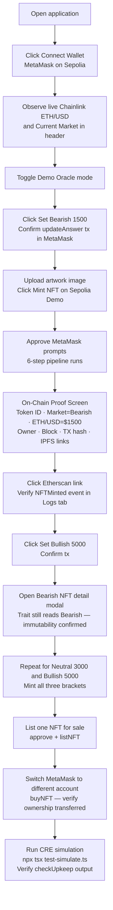

**Step-by-step:**

1. **Connect** MetaMask to Ethereum Sepolia
2. **Enable Demo Oracle Mode** — switches to the `MockV3Aggregator`-connected demo contract
3. **Set Bearish** ($1,500) → confirm `updateAnswer` tx → mint an NFT → observe Bearish badge and Proof Screen
4. **Verify immutability** — set Bullish ($5,000) → open the Bearish NFT → badge is unchanged
5. **Repeat** for Neutral ($3,000) and Bullish ($5,000) to produce all three trait brackets
6. **Marketplace** — list one NFT, buy it from a second wallet, confirm ownership transfer
7. **Etherscan** — inspect any mint tx → Logs → `NFTMinted` event → independently confirm `tokenId`, `market`, `price`
8. **Contract read** — call `getTokenMarket(<tokenId>)` and `tokenMintPrice(<tokenId>)` directly on Etherscan

---

## 📜 License

MIT